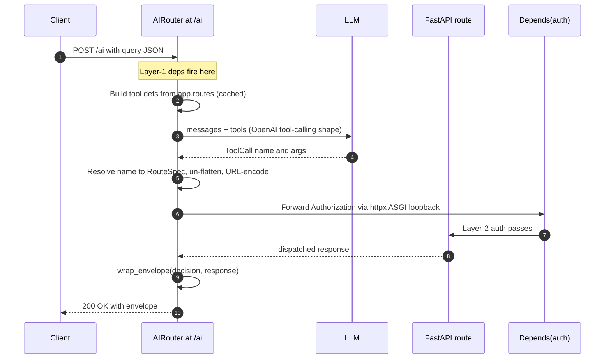
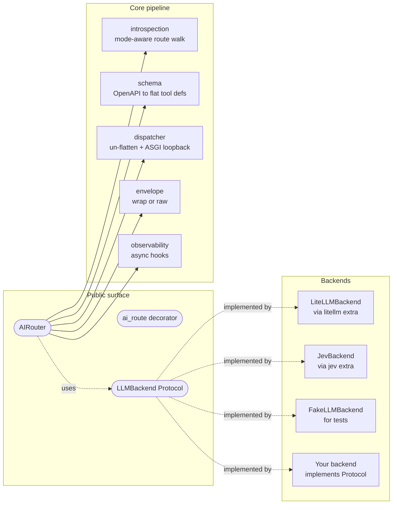
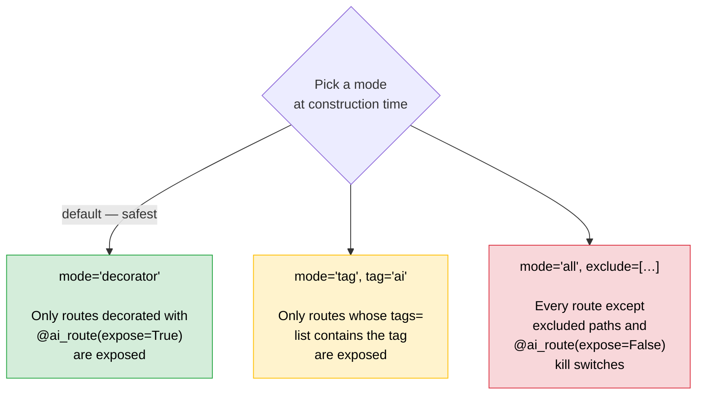
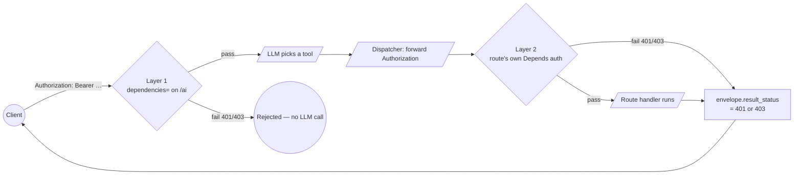

<div align="center">

# fastapi-ai-router

**Turn your existing FastAPI routes into a natural-language-callable surface — in one line.**

Drop-in middleware. Zero new metadata. Uses the OpenAPI schema FastAPI already generates.

Route with any LLM through LiteLLM, or skip the LLM and let TypeSafe's Jev classifier pick the route and its arguments in about 150 ms.

[](https://opensource.org/licenses/MIT)
[](https://www.python.org/downloads/)
[](https://fastapi.tiangolo.com/)
[](https://docs.pydantic.dev/)
[](https://github.com/astral-sh/ruff)
[](https://mypy-lang.org/)
[](#testing)
[](#testing)
[](#choosing-a-backend)
[](#project-status)

</div>

---

## What it does

```python
from fastapi import FastAPI
from fastapi_ai_router import AIRouter, ai_route
from fastapi_ai_router.backends.litellm import LiteLLMBackend

app = FastAPI()


@app.post("/orders/{order_id}/cancel")
@ai_route(description="Cancel a customer's order.")
def cancel_order(order_id: int, reason: str | None = None): ...


AIRouter(app, llm=LiteLLMBackend(model="gpt-4o-mini"))  # one line to enable
```

```bash
$ curl -X POST localhost:8000/ai \
    -H 'content-type: application/json' \
    -d '{"query":"cancel order 123 because it was a duplicate"}'
```

```json
{
  "endpoint": "POST /orders/{order_id}/cancel",
  "args": {"order_id": 123, "reason": "duplicate"},
  "result": {"status": "cancelled"},
  "reasoning": "User wants to cancel order 123 with reason 'duplicate'.",
  "result_status": 200
}
```

That's it. The LLM picked the right route, filled the args, the middleware dispatched the call, and your existing `Depends(auth)` + middleware + Pydantic validation all ran normally.

The same request also works with no LLM at all: [`JevBackend()`](#jev-backend-routing-without-an-llm).

---

## Why this exists

Most LLM "routing" libraries are SaaS gateways or LangChain agents. There was no clean way to add a natural-language layer to an existing FastAPI app — until now. **fastapi-ai-router is the conversational layer for any FastAPI codebase**, and it leans on the OpenAPI schema FastAPI already generates so there's nothing new to maintain.

| Need | Without this library | With this library |
|---|---|---|
| Add NL to one endpoint | Write a LangChain agent + tool wrappers | Add `@ai_route` |
| Add NL to a whole app | Hand-code 50 tool wrappers | `AIRouter(app, llm=...)` |
| Keep auth/middleware/validation | Re-implement in your agent | Free — loopback through FastAPI |
| Swap models or providers | Rewrite agent | Swap `LLMBackend` |
| Route high volume cheaply | Pay for an LLM call per request | `JevBackend`: one classifier call, no LLM |
| Test without an API key | 🥲 | `FakeLLMBackend(returns=ToolCall(...))` |

---

## How it works

`AIRouter(app, llm=...)` adds a single `POST /ai` endpoint to your FastAPI app. On the first request, it walks `app.routes` and projects each one (filtered by `mode`) into a JSON Schema tool definition — using the OpenAPI machinery FastAPI already generates. The user's natural-language `{"query": "..."}` is sent to your LLM along with those tool definitions; the LLM picks one tool and fills its arguments. The middleware then dispatches that call internally via `httpx + ASGITransport` (the same pattern FastAPI's `TestClient` uses), so your existing `Depends(auth)`, middleware, validation, and exception handlers all run normally — auth and tracing headers are forwarded transparently. The dispatched response is wrapped in an envelope showing what the LLM picked and why, and returned to the client with the dispatched call's HTTP status code.

In the [quickstart above](#what-it-does), the LLM read the `cancel_order` route's description and signature, decided it was the right match for `"cancel order 123, it was a duplicate"`, extracted `order_id=123` and `reason="duplicate"` from the natural-language query, and the middleware dispatched the call exactly as if a normal client had hit `POST /orders/123/cancel?reason=duplicate` directly.



Internally the architecture is small and split by responsibility:



Each module has one responsibility, ~100-300 lines, fully typed, fully tested.

---

## Install

```bash
pip install fastapi-ai-router[litellm]   # any LLM, via LiteLLM
pip install fastapi-ai-router[jev]       # TypeSafe's Jev classifier (see below)
```

The `[litellm]` extra gives you OpenAI / Anthropic / Gemini / Ollama / 100+ providers via [LiteLLM](https://github.com/BerriAI/litellm) — usually all you need. To bring your own LLM, implement the `LLMBackend` Protocol and skip the extra entirely:

```bash
pip install fastapi-ai-router
```

---

## Choosing a backend

| | `LiteLLMBackend` | `JevBackend` | `JevBackend(fallback=LiteLLMBackend(...))` |
|---|---|---|---|
| How it picks | LLM tool calling | A classifier picks the route, then picks each argument from values in the query | Jev first; the LLM only for what Jev can't do |
| Speed | One LLM round trip | 140–470 ms per request in a live run | Jev's speed whenever Jev handles it |
| Cost per request | LLM tokens | About $0.00006 | Jev, plus LLM tokens on fallback only |
| Arguments | Anything the schema allows | Integers, numbers, booleans, enums, words from the query | Both |
| Confidence score | No | Yes, calibrated, per route | Yes when Jev routes |
| Key | Your provider's | `TYPESAFE_API_KEY` | Both |

Pick LiteLLM when requests need free-form or structured arguments. Pick Jev when the route and its arguments are sitting in the user's words and latency or cost matters. The fallback combination answers with Jev when it can and calls the LLM only for the rest.

---

## Exposure modes — explicit and safe by default



There is **no silent fallback** between modes — you pick one explicitly. `expose=False` on `@ai_route` is a kill switch that excludes a route from exposure in **every** mode, so you can mark sensitive routes as never-AI-callable regardless of how the AIRouter is configured elsewhere.

| Mode | Use when… | Default safety |
|---|---|---|
| `"decorator"` | You want surgical control over what's AI-callable. | ✅ Safest. Empty surface until you opt in. |
| `"tag"` | You already use FastAPI tags to organize routes. | 🟡 Safe if your tagging is intentional. |
| `"all"` | You're in a sandbox or trust the LLM completely. | 🔴 Footgun. Pair with `exclude=` and `expose=False`. |

---

## Two-layer auth — auth doesn't reinvent itself



- **Layer 1** gates "who can use the AI feature at all" (e.g., paid-tier check on `/ai`).
- **Layer 2** gates "who can call this specific endpoint" — and it's enforced by FastAPI's own `Depends()` chain on each dispatched route. **Nothing about your auth changes.** The `Authorization` header (and other configured headers) is forwarded transparently via the httpx loopback.

---

## Bring your own LLM

```python
from fastapi_ai_router import AIRouter, LLMBackend, Message, ToolCall, ToolDef


class MyBackend:
    async def call(self, messages: list[Message], tools: list[ToolDef]) -> ToolCall | None:
        # call your LLM, parse the response, return ToolCall(...) or None
        ...


AIRouter(app, llm=MyBackend())
```

No subclassing required — the `LLMBackend` is a structural Protocol. Test backends are built the same way:

```python
from fastapi_ai_router.backends.fake import FakeLLMBackend

router = AIRouter(app, llm=FakeLLMBackend(returns=ToolCall(name="cancel", args={"order_id": 7}, ...)))
```

The whole test suite uses `FakeLLMBackend` and a stubbed Jev client, so **it passes deterministically without a single API key.**

---

## Jev backend: routing without an LLM

[Jev](https://docs.typesafe.ai) is TypeSafe's classifier. It doesn't generate text; it picks among options you give it and reports a calibrated confidence. `JevBackend` routes with that. The route is a choice over your tools, and each argument is a choice over values cut from the query (numbers, word spans, enum values). One request covers the route and every argument, typically in 120–350 ms and for a few thousandths of a cent.

```python
from fastapi_ai_router.backends.jev import JevBackend

AIRouter(app, llm=JevBackend())  # reads TYPESAFE_API_KEY
```

A request from a live run against [`examples/05_jev.py`](examples/05_jev.py), answered in 158 ms:

```bash
$ curl -X POST localhost:8000/ai -H 'content-type: application/json' \
    -d '{"query":"please cancel #4521, wrong size"}'
```

```json
{
  "endpoint": "POST /orders/{order_id}/cancel",
  "args": {"order_id": 4521, "reason": "wrong size"},
  "result": {"status": "cancelled", "order_id": 4521, "reason": "wrong size"},
  "reasoning": null,
  "result_status": 200
}
```

`reasoning` is `null` because Jev picks from options instead of writing text. A query that fits no route, such as "what's the weather in Paris", returns `422 no_route_matched`. A missing required value returns a 422 instead of a made-up one: "cancel my order" has no order number, so the response is `422 missing_path_param`.

Jev handles integers, numbers, booleans, enums, and strings that appear word for word in the query. It can't build lists or nested objects, and it doesn't read number words ("five"). For those cases, and whenever it isn't sure which route fits, you can hand the request to an LLM:

```python
from fastapi_ai_router.backends.litellm import LiteLLMBackend

AIRouter(app, llm=JevBackend(fallback=LiteLLMBackend(model="gpt-4o-mini")))
```

| Jev's answer | No fallback | With `fallback=` |
|---|---|---|
| Confident that no route fits | 422 `no_route_matched` | same; the LLM is not called |
| Route confidence below `min_confidence` (default 0.5) | 422 `no_route_matched` | the LLM sees every tool |
| Route chosen, a required argument missing | 422 naming the missing field | the LLM sees only that route's tool |

**Limits:**

- Long queries are cut to the first 254 candidate spans per parameter.
- String values are taken from the query's own words, punctuation stripped. An email address or similar won't survive intact, so route params like that through an LLM fallback.
- Jev reads text literally and isn't hardened against adversarial input; keep route-level auth regardless of backend.
- The SDK's default timeout is 10 s with retries. Tune it by passing your own client: `JevBackend(client=AsyncTypeSafeClient(timeout=..., retry=...))`.

Your `on_decision` hook receives Jev's route confidence as `Decision.confidence`.

---

## Observability — pluggable, no vendor deps

```python
from fastapi_ai_router import AIRouter, Decision, ErrorEvent


async def to_langfuse(d: Decision) -> None:
    await langfuse_client.log(...)


async def to_sentry(e: ErrorEvent) -> None:
    sentry_sdk.capture_message(...)


AIRouter(app, llm=..., on_decision=to_langfuse, on_error=to_sentry)
```

Every routing decision (and every error) flows through async hooks you control. Pipe to Langfuse, OpenTelemetry, Sentry, plain logs, or a Postgres table — the library has zero hard dependency on any tracing vendor.

---

## Error semantics

| Failure | HTTP status | Body shape |
|---|---|---|
| `NoRouteMatched` (LLM declined all tools) | 422 | `{"error":"no_route_matched", "available_tools":[…]}` |
| `UnknownTool` (LLM hallucinated a name) | 422 | `{"error":"unknown_tool", "tool_name":"…"}` |
| `MissingPathParams` (backend left out a path argument) | 422 | `{"error":"missing_path_param", "missing":[…], "endpoint":"…"}` |
| `LLMBackendError` (timeout, rate limit, etc.) | 502 | `{"error":"llm_backend_error", "retryable":true}` |
| Dispatched route 4xx/5xx | passthrough | envelope wraps the response, `result_status` set |
| `DispatchError` (transport failure) | 500 | `{"error":"dispatch_error", "detail":"…"}` |

**Dispatched-route errors are never swallowed.** If the route's `Depends(auth)` rejects with 403, the `/ai` response is also 403 — the library does not silently flatten downstream errors to 200.

---

## What's not in v0.1 — by design

| Feature | Why not in v0.1 | When |
|---|---|---|
| Multi-step / agent loops | Stays out of LangChain's territory; sharp positioning | v0.3+ if there's pull |
| Conversation history | Single-shot is the demo | v0.3+ |
| Semantic caching | Out-of-scope for the first wedge | v0.2 |
| Streaming SSE responses | Adds complexity to the response path | v0.2 |
| Mountable sub-app | Single dedicated endpoint is cleaner | v0.2 |
| Form / multipart bodies | JSON-only keeps the loopback contract simple | v0.2 |
| Semantic prefiltering for 100+ routes | All tools sent every call in v0.1 | v0.2 |

Saying "we don't do this yet" up front is itself a positioning choice — see [docs/concepts.md](docs/concepts.md) for the rationale.

---

## Project status

**Alpha.** v0.1.0 is released. `JevBackend` and the fixes that came with it are listed under Unreleased in [CHANGELOG.md](CHANGELOG.md), which also records every breaking change.

- ✅ Core: introspection + dispatch + envelope + errors + observability
- ✅ Three exposure modes (`decorator` / `tag` / `all`)
- ✅ Backends shipped: `LiteLLMBackend`, `JevBackend`, and `FakeLLMBackend` for tests
- ✅ Test suite passing under an 80% coverage gate, mypy strict, ruff clean
- ✅ Examples + concepts/recipes/security docs

---

## Documentation

| Doc | What it covers |
|---|---|
| [docs/concepts.md](docs/concepts.md) | Mental model, request flow, two-layer auth, mode comparison, caching |
| [docs/recipes.md](docs/recipes.md) | Custom backend, custom forwarding, tracing integrations, large-app strategies |
| [docs/security.md](docs/security.md) | When `mode="all"` is dangerous, prompt injection, header forwarding |
| [examples/](examples/) | Five runnable apps: basic, tag-mode, with-auth, with-observability, Jev |
| [CONTRIBUTING.md](CONTRIBUTING.md) | Dev setup, testing without API keys, adding a backend |

---

## Testing

```bash
uv sync --extra dev
uv run pytest                                   # deterministic, no API keys
uv run pytest --cov=fastapi_ai_router           # coverage report
RUN_LLM_TESTS=1 uv run pytest tests/e2e/        # gated real-LLM smoke tests
RUN_LLM_TESTS=1 uv run --env-file .env pytest tests/e2e/test_with_real_jev.py   # real Jev calls
```

The test suite is **deterministic and network-free** by default. Every test uses `FakeLLMBackend` or a stubbed Jev client. Real-LLM and real-Jev tests are gated behind env vars and run only on release tags in CI.

---

## Contributing

PRs welcome. See [CONTRIBUTING.md](CONTRIBUTING.md) for dev setup and the bar for new code (TDD, mypy strict, ruff clean, 80%+ coverage).

Particularly welcome:
- New `LLMBackend` adapters (Anthropic-direct, Gemini-direct, vLLM, Ollama-direct, etc.)
- Bug reports with minimal repro
- Doc improvements

---

## License

[MIT](LICENSE) — do whatever you like, attribution appreciated.

<div align="center">

Built with care for the FastAPI community.

</div>
